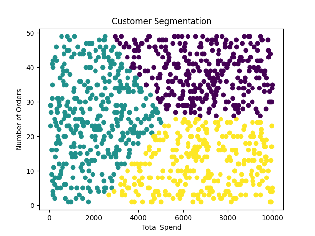

# 🧠 Customer Segmentation with K-Means Clustering

This project applies **K-Means clustering** to segment customers based on their **total spend** and **number of orders**. It's a foundational machine learning workflow useful for targeted marketing, personalized recommendations, and business analytics.

---

## Table of Contents

- [Overview](#overview)
- [Technologies Used](#technologies-used)
- [How It Works](#how-it-works)
- [Installation](#installation)
- [Results](#results)
- [Visualizations](#visualizations)
- [License](#license)


---

## Overview

Customer segmentation helps businesses understand their customer base by grouping similar customers together. This script:

- Loads customer data from a CSV
- Scales relevant features
- Applies the **Elbow Method** to find the optimal number of clusters
- Trains a **K-Means model**
- Labels and visualizes the clusters

---

## Technologies Used

- Python 3.x
- pandas
- scikit-learn
- matplotlib
- seaborn

---

## How It Works

### **Data Preprocessing**:
   - Select relevant features: `total_spend`, `num_orders`
   - Standardize the data using `StandardScaler`

###  **K-Means Clustering**:
   - Use the **Elbow Method** to determine the optimal number of clusters
   - Apply **K-Means** with the chosen number of clusters (default: 3)

###  **Analysis & Visualization**:
   - Add cluster labels to the dataset
   - Display descriptive statistics per cluster
   - Visualize clusters using scatter plots


1. **Data Loading**: Reads customer data from `./data/customers.csv`
2. **Preprocessing**: Selects `total_spend` and `num_orders` for clustering
3. **Feature Scaling**: Uses `StandardScaler` to normalize features
4. **Elbow Method**: Determines the optimal number of clusters (found to be 3)
5. **K-Means Clustering**: Clusters customers and assigns labels
6. **Visualization**: Scatter plot to display clusters

---

## Installation

### 1. Clone the Repository

```bash
git clone https://github.com/Pragyapssharma/Customer-Segmentation-1.git
cd Customer-Segmentation-1
```

### 2. Install Dependencies

```bash
pip install pandas scikit-learn matplotlib seaborn
```

### 3. Run
Run the script:
python customer_segmentation1.py

```bash
python customer_segmentation1.py
```

This will:
- Display the Elbow curve
- Output cluster statistics
- Show a scatter plot of clustered customers

## Results
- The optimal number of clusters was determined to be 3
- Each customer is labeled with a cluster ID
- Summary statistics are shown per cluster
- A scatter plot of customer clusters (total_spend vs num_orders)
- Descriptive statistics for each cluster


## Visualizations
- Elbow Curve to determine the number of clusters


- Cluster Scatter Plot of total_spend vs num_orders




## License
This project is open-source and free to use for learning and personal development.


